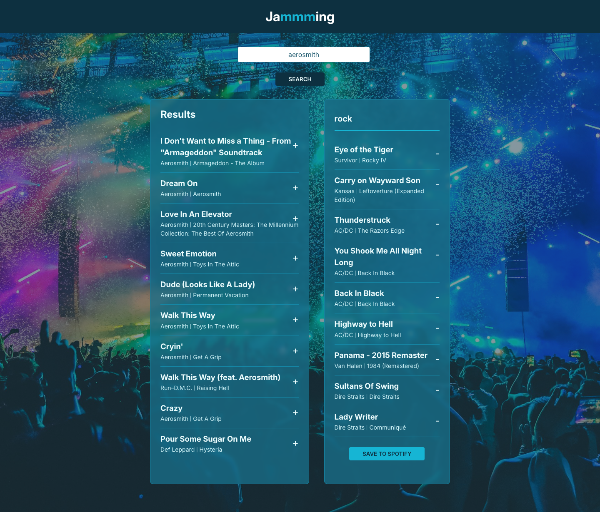

# Jammming

This is a React web application called Jammming. It is a portfolio project within the "React, Part II" section of the [Full-Stack Engineer](https://www.codecademy.com/learn/paths/full-stack-engineer-career-path) career path from Codecademy.

## Brief

You will use your knowledge of React components, passing state and requests with the Spotify API to build a website that allows users to search the Spotify library, create a custom playlist, and save it to their Spotify account.

### Project Requirements

- Build a web app using React
- Version control your application with Git and host the repository on GitHub
- Integrate with Spotify or another API
- Deploy your application
- Write a README (using Markdown) that documents your project, including:
  - The purpose of your project
  - Technologies used
  - Features
  - Future work

### Features:

- Users can search for songs by song title.
  - You can also include functionality to search by other attributes like artist’s name, genre, etc.
- Users can see information about each song like title, artist, and album for songs they queried
  - You can also include other information – the design is up to you
- Users can export their custom playlist to their personal Spotify account

## Project Tasks

- [x] [Set Up Your Local Environment](#set-up-your-local-environment)
- [x] [Set Up Version Control](#set-up-version-control)
- [x] [Create Static Components](#create-static-components)
- [x] [Implement Track Listing in The Component Tree](#implement-track-listing-in-the-component-tree)
- [x] [Implement Adding Songs To a Custom Playlist](#implement-adding-songs-to-a-custom-playlist)
- [x] [Implement Removing Songs From a Custom Playlist](#implement-removing-songs-from-a-custom-playlist)
- [x] [Implement Playlist Renaming](#implement-playlist-renaming)
- [x] [Implement Saving the Playlist to a User's Account](#implement-saving-the-playlist-to-a-users-account)
- [x] [Obtain a Spotify Access Token](#obtain-a-spotify-access-token)
- [x] [Implement Spotify Search Request](#implement-spotify-search-request)
- [x] [Save a User's Playlist](#save-a-users-playlist)
- [x] [Testing and Debugging](#testing-and-debugging)
- [x] [Review Your Project](#review-your-project)

### Set Up Your Local Environment

On your computer, create a React app named Jammming (mind the extra “m”!) with your preferred terminal.

Run your application locally to see what it looks like in the browser.

### Set Up Version Control

Set up the folder you created previously to be a Git repository (if you used `create-react-app` above, you may skip this step because `create-react-app` automatically configures the local Git repository).

Now, set up a remote origin and push the initial files to a repository on GitHub. You should be consistently committing your changes throughout the project. Make sure to have meaningful commit messages.

### Create Static Components

Create components for your Jammming application. You may structure your components as you see fit, but you should have a component representing each of these core components of the interface:

- App
- SearchBar
- SearchResults
- Playlist
- Tracklist
- Track

Additionally, make sure that your interface has a `Save To Spotify` button and a `Search` button.

### Implement Track Listing in The Component Tree

When a user requests data from Spotify, the JSON response will contain a set of song tracks. Your Jammming web app should display the song name, artist, and album for each track in the results list.

Implement this by creating a unidirectional data flow from your root component. The root component should pass down the search results to a child component that will return each individual track to be rendered.

Since the Spotify API is not currently set up to be called, you may hard-code an array of track objects to be passed down for now.

### Implement Adding Songs To a Custom Playlist

Your Jammming web app should allow users to add songs from the search results to their custom playlist. To achieve this, implement a method that adds a selected song from the search results track list to the user’s custom playlist. The method should be triggered when the user clicks an “add” button displayed next to each track in the search results list.

### Implement Removing Songs From a Custom Playlist

Along with adding, your Jammming web app should allow users to remove songs from their playlists.

This function should trigger when the user presses the “remove” button next to a displayed track. To achieve this, implement a method that removes a selected song from the user’s custom playlist.

### Implement Playlist Renaming

One essential feature of a music application is customization. Provide users with more control over their music by allowing them to rename their playlists.

Implement code that enables a user to change the name of their playlist. The user should be able to click on the title of their playlist and type in a new name to replace the existing name.

### Implement Saving the Playlist to a User's Account

Jammming’s main feature is allowing users to export their created playlist and save it to their personal Spotify account. Implement a feature to save a user’s playlist to their Spotify account and reset the existing playlist on the web app.

As a part of this goal, you should access a `track` property named [`uri`](https://developer.spotify.com/documentation/web-api/reference/get-track). Spotify uses this field to reference tracks in the Spotify library. You should create an array containing the `uri` of each track in the playlist.

At this point, you don’t need to interact with the Spotify API quite yet. Use mock data to test your implementation.

### Obtain a Spotify Access Token

To use the Spotify API with Jammming, you need to get a user’s Spotify access token to make Spotify API requests.

Create a JavaScript module that will handle the logic for getting an access token and using it to make requests. The method should have a way to get a user’s access token and store it.

### Implement Spotify Search Request

Connect the search bar to Spotify so that it can query data from the Spotify API. Your implementation should enable users to enter a search parameter and receive a response from the Spotify API. You should display the results from the request to the user.

To make your request to the API, use the `/v1/search?type=TRACK` endpoint. You can refer to the [Spotify Web API Endpoint Reference](https://developer.spotify.com/documentation/web-api/reference/#/) for guidance on formatting your request.

### Save a User's Playlist

Create a method that writes the user’s custom playlist in Jammming to their Spotify account. The user should be able to save their custom playlist from Jammming into their account when they click the “Save To Spotify” button.

To implement this feature, you will need to make requests to create new playlists on the user’s Spotify account with the playlist’s custom name and add the tracks from the user’s custom playlist to the new playlist.

### Testing and Debugging

Test often and test early. Testing frequently during the development process can help you identify issues and bugs sooner, making them easier and less time-consuming to fix. Wrap up your project by testing and debugging each component.

1. Identify the components and functionalities of your project that need to be tested.
2. Create test cases
3. Execute the test cases
4. Identify any issues or bugs that need to be fixed
5. Implement your fix and perform a final test to ensure that all components and functionalities of your project are working as expected

### Review Your Project

Congratulations! You’ve completed the Jammming project.

You’ve come a long way. Let’s review what you’ve accomplished:

- You gained a strong understanding of React.js by creating a web application that interacts with the Spotify API.
- You gained an understanding of how to interact with an external API to make HTTP requests and make changes to a user’s account.
- You implemented user authentication that allows your web app users to log in and securely interact with the account.

Over the course of this project, you utilized the React library, importing and exporting components, the Spotify API, props, and more to achieve a fully functioning music web application.

You should be proud of how far you’ve come. Completing this project is a significant accomplishment for any learners looking to gain practical experience!
